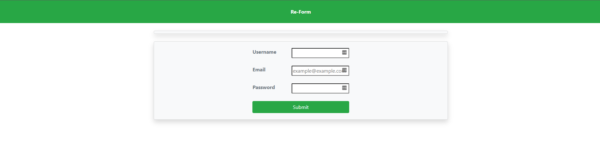
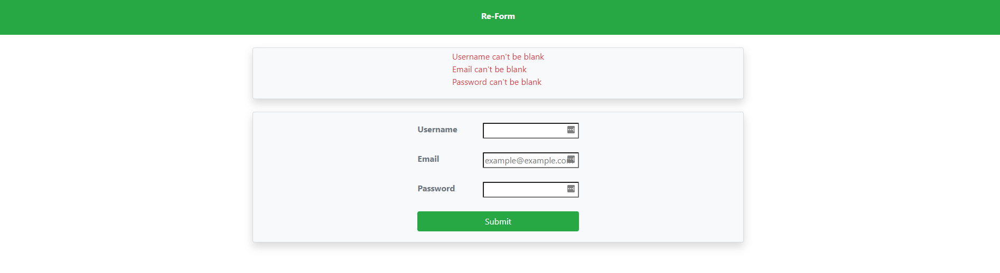

# Re-Former

> Made as a practice for form validations in rails. The app works in the development environment. It allows you to create new users and edit them.

## Built With

- Ruby
- Ruby on rails
- SQLite3

## Pre-requisites

- Ruby 2.7.0
- Rails gem
- Bundle

## How it works

- Clone the repository locally from [here](https://github.com/karmaester/re-former)
- Open re-former folder and run `Bundle install`
- Run `rails db:migrate`
- Run `rails server`
- Open your browser
- Type `http://localhost:3000/`

## How edit works

- Add at least one user
- Type the path with the id (i.e. `http://localhost:3000/users/1/edit`)
- Click on update.

## Authors

👤 **Khristian Rojas**

- Github: [@githubhandle](https://github.com/karmaester)
- Twitter: [@twitterhandle](https://twitter.com/karmaendlich)
- Linkedin: [linkedin](https://www.linkedin.com/in/khristian-rojas/)

👤 **Kevin Cotrina**

- Github: [@githubhandle](https://github.com/kcotrinam)
- Twitter: [@twitterhandle](https://twitter.com/KevinCot12)
- Linkedin: [linkedin](https://www.linkedin.com/in/kevin-cotrina-6208b7149/)

## 🤝 Contributing

Contributions, issues and feature requests are welcome!

Feel free to check the [issues page](https://github.com/karmaester/re-former/issues).

## Show your support

Give a ⭐️ if you like this project!

## Acknowledgments

- The Odin Project
- Rails guides
- Microverse

## 📝 License

This project is [MIT](lic.url) licensed.
